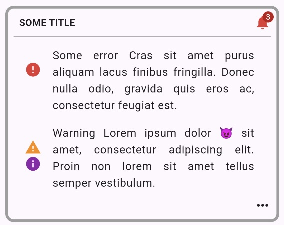

# message_slot_bubblegum


> Flutter widget to help you pop your messages

A Flutter component leveraging Material3 to dynamically render different layouts based on message content and slot configurations. It helps developers easily display messages of varying prominence and size, including customizable badges and message grouping.



Highlights:

* Integrates `CopperframeMessage` and `CopperframeSlotBase` models to support dynamic layout rendering.
* Offers four different size configurations (`bar`, `small`, `medium`, `large`) with adjustable message counts and layout rules.
* Customizable visual prominence (`low`, `medium`, `high`) to ensure appropriate emphasis for different use cases.
* Supports badge display with configurable visibility based on message availability.
* Handles edge cases such as no messages gracefully, ensuring a smooth user experience.


A few examples:

BubblegumMessageSlot Example:
```dart
BubblegumMessageSlot(
  slot: _infoSlot,
  messages: loopData.slotMessages.current().value,
  options: BubblegumMessageSlotOptsBuilder()
    .setIconCollection(IconRepo.iconCollection)
    .setGroupMessagesByLevel(true)
    .setOnTapHint('Fix the content')
    .setOnMessageTap((message) => setState(() {
      clickCounter++;
    }))
    .build(),
)

```

## Documentation and links

* [Code Maintenance :wrench:](MAINTENANCE.md)
* [Code Of Conduct](CODE_OF_CONDUCT.md)
* [Contributing :busts_in_silhouette: :construction:](CONTRIBUTING.md)
* [Architectural Decision Records :memo:](DECISIONS.md)
* [Contributors :busts_in_silhouette:](https://github.com/flarebyte/message_slot_bubblegum/graphs/contributors)
* [Dependencies](https://github.com/flarebyte/message_slot_bubblegum/network/dependencies)
* [Glossary :book:](https://github.com/flarebyte/overview/blob/main/GLOSSARY.md)
* [Software engineering principles :gem:](https://github.com/flarebyte/overview/blob/main/PRINCIPLES.md)
* [Overview of Flarebyte.com ecosystem :factory:](https://github.com/flarebyte/overview)
* [Dart dependencies](DEPENDENCIES.md)
* [Usage](USAGE.md)
* [Example](example/example.dart)

## Related

* [Material Design 3](https://m3.material.io/)
* [Flutter Documentation](https://docs.flutter.dev/)
